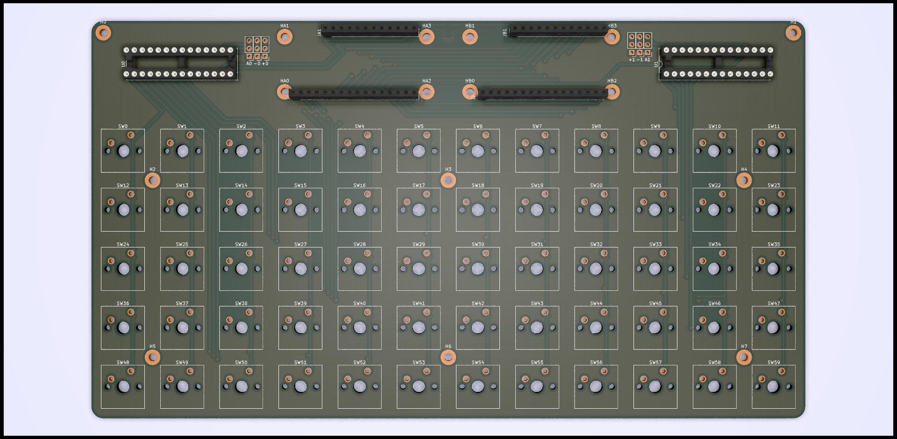

OrthoWing
=========

- **dimensions**: 229.87mm × 128.27mm
- **layers**: 2

This is a Feather-compatible keyboard. It has a 5×12 ortholinear layout which
makes it very portable and a good fit for exotic use-cases (such as
macro-keyboards). The holes are designed for Cherry MX-compatible switches,
with no extra features.

Usage
-----

Both Feather sockets are interconnected, just like [Adafruit's FeatherWing
Doubler](https://www.adafruit.com/products/2890). The chip sockets hold two
MCP23017 I/O expanders, one on the left to select the column and one on the
right to get the keys pressed on each row for that column.

A controller Feather must also be attached, which scan the key matrix using
these two expanders through I²C. With the help of the second socket and
stacking headers, lots of FeatherWings can be added to provide additional
features!

Use cases
---------

Given a suitable controller (like this [Adafruit Feather
32u4](https://www.adafruit.com/product/2771)), it can be a regular USB
keyboard!

If you want something more exotic, I encourage you to try to push the limits
of the Feather interface! There are compatible displays, sensors, wireless
transceivers, even [quite powerful
FPGAs](https://github.com/gregdavill/OrangeCrab). The keyboard itself doesn't
use any GPIO pins, just the I²C pins (which are shared among all devices
attached), so these are all free.

License
-------

The [keyswitches.pretty
library](https://github.com/daprice/keyswitches.pretty) used in this project
has it's own license, specified in their repository.

This project is licensed under the [Creative Commons Attribution-ShareAlike
4.0 International License](http://creativecommons.org/licenses/by-sa/4.0/).
